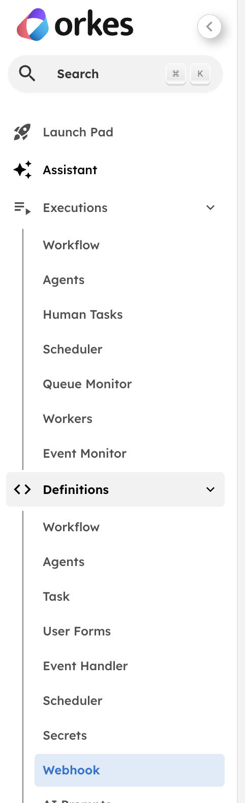
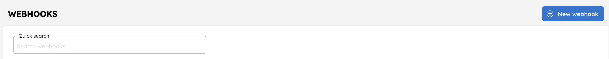

# Webhooks Codelab

This interactive codelab will teach you how to use a `WAIT_FOR_WEBHOOK` task to resume an in-progress workflow after suspending its execution for up to 7 days. It is an implementation of the concepts mentioned [in this blog post from our CTO, Viren Baraiya](https://orkes.io/blog/late-bound-sagas-why-your-agent-is-not-an-llm-in-a-loop#what-it-looks-like-in-motion).

## Preparation

You will need to update the contents of `../settings.py` then confirm both Python scripts included in this directory execute correctly before you can start the codelab content.

Detailed instructions contained here

1. Review all configuration variables in `../settings.py` that have a comment beginning with "Replace" next to them. These need to be updated for your own account details.
2. After replacing `integration_name` and `llm_model` with your integration details, run `python -m webhooks.deploy_wait_for_webhook_workflow` from the top-level directory for all codelabs. This will deploy and run a workflow called "wait_for_webhook_demo" to your Orkes account that looks like this:

    

3. Before sending a webhook payload you will need to create a new webhook for your account. **Note that in the free developer version of Orkes Conductor you are only allowed to have one webhook defined.** Click on the following tab in the Orkes Conductor UI:

    

4. Now click the "New webook" button in the top-right hand corner:

    

5. Feel free to name your new webhook whatever you like. Note that it _must_ have the `wait_for_webhook_demo` workflow selected in the "Workflows to receive webhook event" dropdown and the "Source platform" set to "Custom". Additionally, you _must_ add a header with a key entitled "source" and a descriptive value such as `wait-for-webhook-demo-value`; we'll be using it later for the webhook payload. It should look something like this before you click the "Save" button in the top-right hand corner of the page:

    

6. Before running the send_webhook_payload script, we need to update `settings.py` again with the details of our new webhook. Set `webhook_id` to the ID of your new webhook which can be found [in the configure-webhooks page of Orkes Conductor](https://developer.orkescloud.com/configure-webhooks). Set `source_header` to the value of the "source" header you entered in your webhook; I suggested `wait-for-webhook-demo-value` as an example. Finally, make sure you have at least one [Integration added to your Orkes account](https://developer.orkescloud.com/integrations?view=connections-and-resources) - change `integration_name` to the name of your desired integration, and `llm_model` to the specific model that this Integration uses.
7. Now run `python -m webhooks.send_webhook_payload` from the top level directory and keep an eye on the "wait_for_webhook_demo" execution from step 2. If everything is configured correctly, you will receive a `200` status response from the send_webhook_payload script, and there will now be some output in the `llm_chat_complete` task:

    

You are now ready to proceed with the exercises!

## Exercise 1

(TBD)

## Exercise 2

(TBD)

## Exercise 3

(TBD)
