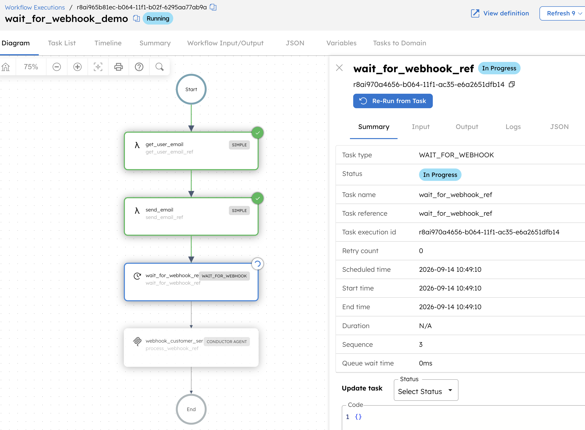
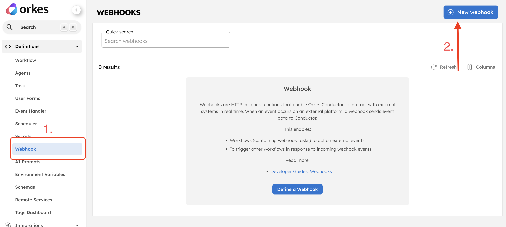
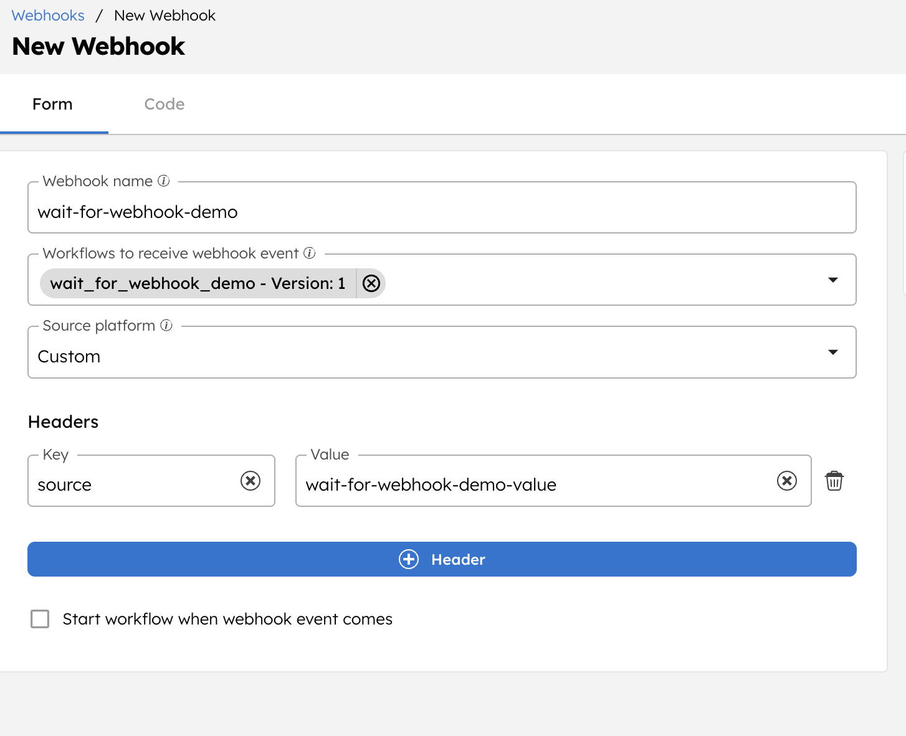
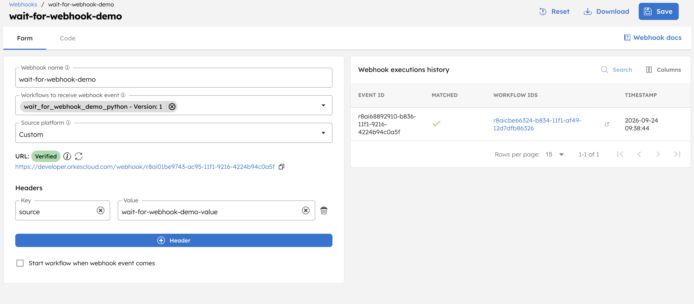
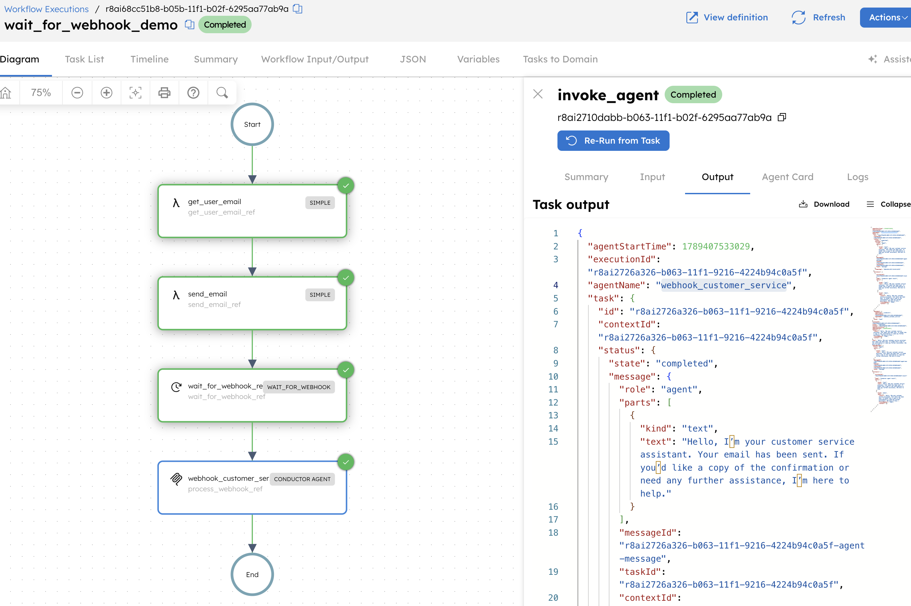

# Webhooks Codelab

This interactive codelab will teach you how to use a
[`WAIT_FOR_WEBHOOK` task](https://orkes.io/content/reference-docs/system-tasks/wait-for-webhook)
to resume an in-progress workflow after suspending its execution for up to 7
days. It is an implementation of the concepts mentioned
[in this blog post from our CTO, Viren Baraiya](https://orkes.io/blog/late-bound-sagas-why-your-agent-is-not-an-llm-in-a-loop#what-it-looks-like-in-motion).
By the end of this codelab, you will have built a durable email-processing
pipeline that sends emails in parallel, stores their receipts in a local
database, and pauses until an external webhook resumes the workflow. A
multi-turn agent will then analyze the stored email activity and produce a
concise digest.

## Preparation

You will need to update the contents of `../settings.py` then confirm both
Python scripts included in this directory execute correctly before you can
start the codelab content.

Detailed instructions contained here

1. Review all configuration variables in `../settings.py` that have a comment
   beginning with "Replace" next to them. These need to be updated for your own
   account details.

2. After replacing `integration_name` and `llm_model` with your integration
   details, run `python -m webhooks.deploy_wait_for_webhook_workflow` from the
   top-level directory for all codelabs. This will deploy and run a workflow
   called "wait_for_webhook_demo" to your Orkes account that looks like this:

    

      
    

3. Before sending a webhook payload, follow the
   [webhook integration guide](https://orkes.io/content/developer-guides/webhook-integration)
   to create a new webhook for your account. **Note that in the free developer
   version of Orkes Conductor you are only allowed to have one webhook defined.**
   Click on the Webhook tab in the Orkes Conductor UI, then click the "New
   webhook" button in the top-right hand corner:

    

      
    

4. Feel free to name your new webhook whatever you like. Note that it _must_
   have the `wait_for_webhook_demo` workflow selected in the "Workflows to
   receive webhook event" dropdown and the "Source platform" set to "Custom".
   Additionally, you _must_ add a header with a key entitled "source" and a
   descriptive value such as `wait-for-webhook-demo-value`; we'll be using it
   later for the webhook payload. It should look something like this before you
   click the "Save" button in the top-right hand corner of the page:

    

      
    

5. Before running the send_webhook_payload script, we need to update
   `settings.py` again with the details of our new webhook. Set `webhook_id` to
   the ID of your new webhook which can be found
   [in the configure-webhooks page of Orkes Conductor](https://developer.orkescloud.com/configure-webhooks).
   Set `source_header` to the value of the "source" header you entered in your
   webhook; I suggested `wait-for-webhook-demo-value` as an example. Finally,
   make sure you have at least one
   [Integration added to your Orkes account](https://developer.orkescloud.com/integrations?view=connections-and-resources) -
   change `integration_name` to the name of your desired integration, and
   `llm_model` to the specific model that this Integration uses.

6. After the workflow reaches `wait_for_webhook_ref` and stores its email
   records, run `python -m webhooks.serve_webhook_agent` in another terminal.
   Leave this process running so it can serve the agent's local database tools
   after the workflow resumes.

7. Now run `python -m webhooks.send_webhook_payload` from the top-level
   directory and keep an eye on the "wait_for_webhook_demo" execution from step 2. If everything is configured correctly, you will receive a `200` status
   response from the `send_webhook_payload` script, your webhook will show a
   successful execution in the Orkes Conductor UI, and there will now be some
   output in the `invoke_agent` task. After the workflow completes, stop
   the agent tool worker process with Ctrl+C.

    

      
    

    

      
    

You are now ready to proceed with the exercises!

## Exercise 1: Increase Durability with Persistent Local Storage

Your goal for this exercise is to store the output from every completed
`send_email` task in a local database.

As noted in Viren's linked blog post, one of the big perks to this late-bound
saga architectural approach is we can write data from our tasks before the
`WAIT_FOR_WEBHOOK` to disk so we are no longer bound by our agentic runtime. We
can take this concept even further by storing data in a SQL database for
guaranteed ACID compliance and data integrity during the "suspended" portion of
our saga.

There are a wide variety of databases that you can use in projects, but for the
sake of simplicity in this codelab we're going to use a local
[sqlite3 database](https://docs.python.org/3/library/sqlite3.html) since this
comes built-in with Python 3. To create a new database called
"webhook_codelab_storage", run `python3 utils/create_sqlite_db.py`. Be sure to
inspect this file to understand the schema of the "emails" table.

To achieve this, update `utils/workers.py` so that each invocation of the
`send_email` worker returns the relevant information about its sent email. In
`deploy_wait_for_webhook_workflow.py`, retrieve the outputs from all completed
`send_email` task executions and insert one row per output into
`utils/webhook_codelab_storage.db`.

**Note: Although the starter workflow sends only one email, you will want to
keep the retrieval and persistence logic collection-based so it continues to
work in future exercises!**

You can check that your code is writing data to the database correctly by using
the provided `utils/query_sqlite_db.py` helper file.

## Exercise 2: "Fan Out" by Scaling Email Inputs

Now that we have verified that we can durably store our email data in a local
database, we can expand on the workflow itself. Currently we're only
processing a single email which isn't a particularly powerful or representative
use case. For this exercise, your goal is to implement "the fan-out" part of the
saga in Viren's blog post; your workflow should accept multiple user IDs and
send an email to each user with parallel task executions.

Update the workflow and webhook payload to use a list of `user_ids` instead of a
single `user_id`, then resolve all email addresses in one worker task. Next, use
the [`DynamicForkTask`](https://orkes.io/content/reference-docs/operators/dynamic-fork)
to create one uniquely referenced `send_email` task per recipient email
address, followed by a `JoinTask` before the existing `WAIT_FOR_WEBHOOK` task.
Your code from the Exercise 1 solution should store one database row for every
completed email task.

## Exercise 3: Multi-Turn Agentic Processing

We have now scaled up the email inputs to our persistent pipeline. Now it's
time to update the agent downstream from the `WAIT_FOR_WEBHOOK` task, since it
currently doesn't do anything meaningful with the email data.

In this exercise, give the `webhook_customer_service` agent two new tools:

1. `summarize_email_activity`, which returns the total number of stored emails
   and the number sent to each recipient.
2. `get_recipient_email_history`, which returns the detailed records for one
   recipient.

Implement both functions as read-only tools using the SDK's `@tool` decorator,
then add them to the agent's tool list. Have the agent first review the summary,
identify the recipient with the greatest number of stored emails, retrieve that
recipient's history, and then write a concise activity digest.

You will also need to update the webhook's `agent_input` to request this
analysis. After the workflow reaches `WAIT_FOR_WEBHOOK` and the launcher exits,
run `python -m webhooks.serve_webhook_agent` in another terminal. Keep this
separate process running while you send the webhook so the resumed workflow can
execute the agent's local database tools.

As part of your verification, confirm that the Conductor execution contains two
dependent tool calls followed by the final digest.

## Recap: What You Built

By completing this codelab, you built a durable, event-driven email workflow
that:

- Resolves multiple user IDs in one `get_user_emails` task, then uses a
  `DynamicForkTask` and `JoinTask` to send the emails in parallel.
- Collects every completed `send_email` result and stores the records in a local
  database while the workflow is suspended.
- Uses `WAIT_FOR_WEBHOOK` to pause without consuming worker resources, then
  resumes when a matching external event arrives.
- Hands the durable email history to a multi-turn agent that summarizes the
  overall email activity.

This demonstrates the central idea from
[Late-Bound Sagas: Why Your Agent Is Not an LLM in a Loop](https://orkes.io/blog/late-bound-sagas-why-your-agent-is-not-an-llm-in-a-loop):
Conductor owns the execution state across task and process boundaries, while
workers perform concrete actions and the LLM decides what information it needs
next. The end result from this codelab combines dynamically selected agent
actions with the durable execution, suspension, and resumption cycle of a saga.

## Further Explorations: Beyond This Codelab

Here are a few ways you can continue expanding on the concepts covered in this
codelab.

### Process More Emails

We currently derive a small, fixed set of email addresses from the hardcoded
user IDs. Consider supplying a larger data set from a file, input generator, or
external API. Then create _hundreds_ of dynamic branches to observe how
Conductor schedules tasks, manages worker throughput, and joins results under
load.

### Migrate to a Cloud Database

We use SQLite to keep this codelab simple and self-contained. Consider replacing
it with a more advanced cloud-based platform such as
[Databricks](https://docs.databricks.com/aws/en/) or
[Snowflake](https://docs.snowflake.com/en/user-guide/databases). This will let
you handle larger data sets and allow for shared data access while keeping your
data storage layer separate from the agent runtime.

### Add More Summarizing Agents

In Exercise 3, we use a single agent to summarize all email activity. Consider
dividing the analysis among specialized agents by recipient, subject, or time
period, then using a coordinating agent to combine their findings into a single
digest. This will let you explore parallel agent collaboration and the advanced
scaling needed to process more email traffic.
